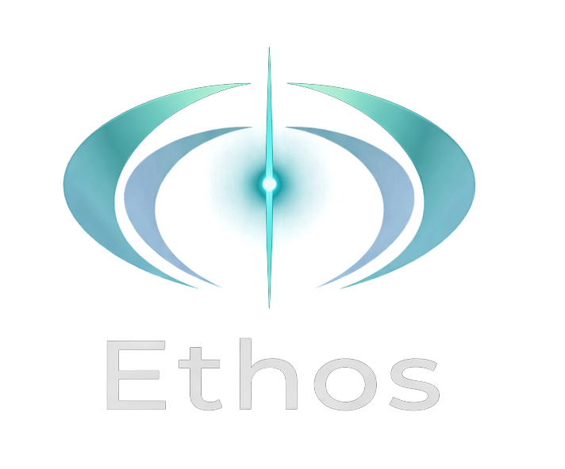

<p align="center">
  
</p>

<h1 align="center">Ethos</h1>

<p align="center">
  <strong>Universal Value Extraction Pipeline. Behavioral training data for AI alignment.</strong>
</p>

<p align="center">
  <a href="#how-it-works"></a>
  <a href="API_REFERENCE.md"></a>
  <a href="#the-15-values"></a>
  <a href="#testing"></a>
</p>

---

> **This is the open-source Ethos extraction pipeline.** It provides the full value extraction, resistance scoring, and training data export capabilities described below. For the complete Verum product, including real-time value alignment scoring, SHA-256 signed certification, interactive reports, and dataset compilation, visit **[trust-forged.com](https://trust-forged.com)**.

---

**Ethos** extracts behavioral evidence of human values from documented human conduct and produces labeled training data for AI alignment research.

The pipeline is source-agnostic: it processes historical archives, contemporary journals, personal blogs, interview transcripts, social media posts, conversational records, or any text associated with an identifiable person. A value stated in comfort is weak signal. A value demonstrated at personal cost, under threat, under pressure, against interest, is strong signal. Ethos measures that cost.

---

## What Makes This Different

Most value-alignment work in AI is built on shaky ground:

- Human preference rankings capture what people *say* they value, not what they *do*
- Synthetic datasets are another model's opinion dressed up as ground truth
- RLHF measures preference, not principle
- Constitutional AI encodes rules from the top down, not evidence from the bottom up

Ethos goes to the source: documented human behavior under real conditions, from any era, any social position, any medium. The same pipeline processes a letter written by Abraham Lincoln in 1863 and a blog post written by a nurse in 2025. The resistance score measures what nobody else is measuring systematically: the cost of holding a value when it would be easier not to.

When Ethos flags a value signal, the answer to "why?" traces back to a real person, a real moment, and a real cost. That person can be a head of state or a line cook. The behavioral signal is in the conduct, not the fame.

---

## The 15 Values

| Value | What it means in practice |
|-------|--------------------------|
| **Integrity** | Honest and truthful. Says what is real, refuses deception even at cost to self. |
| **Courage** | Acts despite fear. Faces difficulty, speaks unpopular truths, accepts loss. |
| **Compassion** | Responds to suffering. Prioritizes others' wellbeing over personal convenience. |
| **Resilience** | Continues through adversity. Rebuilds after failure, does not stop when it is hard. |
| **Patience** | Waits without forcing. Allows things to unfold at the pace they require. |
| **Humility** | Acknowledges limitation. Defers when others know better, gives credit, admits error. |
| **Fairness** | Applies consistent standards. No favoritism, same measure for all parties. |
| **Loyalty** | Keeps faith with commitments and people. Does not abandon under pressure. |
| **Responsibility** | Owns outcomes. Accepts consequences, does not deflect, stays to the end. |
| **Growth** | Transforms through experience. Allows past errors to change present understanding. |
| **Independence** | Acts on own judgment. Does not require permission to do what conscience demands. |
| **Curiosity** | Pursues understanding. Follows questions past convenience. |
| **Commitment** | Sees things through. Stays when it costs something. |
| **Love** | Acts for others' wellbeing. Prioritizes the beloved over self. |
| **Gratitude** | Recognizes what was given. Carries the debt of others' generosity forward. |

---

## How It Works

### 1. Ingestion

Text is segmented into sentence-bounded passages. Each passage is stored with metadata:

- **Document type** (journal, letter, blog, speech, action) affects resistance scoring. Private writing scores higher than public speech. Documented behavior scores highest.
- **Source authenticity** tracks whether the text is original (1.0), translated (0.85), or uncertain (0.70).
- **Publication year** drives a temporal discount for archaic texts. Contemporary sources receive no discount.

### 2. Multi-Layer Extraction

Each passage runs through up to seven independent extraction layers:

| Layer | What it does | Requires |
|-------|-------------|----------|
| **L1 Keywords** | 15 value vocabularies with context disambiguation | Nothing (stdlib) |
| **L1b Lexicons** | MFD2.0 (2,041 entries) + MoralStrength (452 entries) | Bundled data |
| **L1c Phrase** | Pronoun-aware agency detection | Nothing (stdlib) |
| **L2 Semantic** | BGE-large-en-v1.5 embeddings against 322 prototypes | sentence-transformers |
| **L3a Structural** | Adversity, agency, resistance, and stakes patterns | Nothing (stdlib) |
| **L3b Zero-shot** | DeBERTa entailment against per-value hypotheses | transformers |
| **L3c MFT** | Moral Foundations Theory classification (10 labels) | transformers |

The pipeline degrades gracefully. If ML dependencies are absent, the keyword, lexicon, phrase, and structural layers run on stdlib alone. Each layer is independent. Agreement across layers strengthens confidence.

### 3. Resistance Scoring

```
resistance = base + significance_bonus + doc_type_bonus + text_tier_bonus
```

Text tier bonuses are awarded based on what the passage contains:

| Tier | Trigger | Bonus |
|------|---------|-------|
| **A: Mortal Stakes** | Death, execution, "I would rather die" | +0.62 |
| **B: High Adversity** | Imprisonment, exile, persecution, direct threats | +0.36 |
| **C: Standard Adversity** | "despite", "even though", "scared but", "at a cost" | +0.24 |

**Hold markers** ("nevertheless", "stood firm", "refused to yield") add +0.05 per tier.
**Failure markers** ("gave in", "surrendered", "backed down") suppress Tiers B and C.

### 4. Classification

Each observation receives a label:

| Label | Meaning | Threshold |
|-------|---------|-----------|
| **P1** | Value held under meaningful resistance | resistance >= 0.55 |
| **P0** | Value failed or corrupted | resistance <= 0.35 |
| **APY** | Answer-Pressure Yield: abandoned under external pressure | Pressure markers + failure |
| **AMBIGUOUS** | Between thresholds, insufficient evidence either way | 0.35 < resistance < 0.55 |

### 5. Registry Weight

The strength of a value in a figure's profile:

```
weight = demonstrations x avg_significance x avg_resistance x consistency
```

Consistency is a 4-component score:
- **Volume** (30%): saturates at 10 observations
- **Resistance stability** (30%): low variance in resistance scores
- **Temporal spread** (25%): observations spread over time
- **Source diversity** (15%): multiple document types

---

## Quick Start

**Requirements:** Python 3.10+

```bash
pip install -r requirements.txt
```

### Ingest a source

```bash
# Historical figure
python -m cli.ingest --figure gandhi --file gandhi_journal.txt \
    --doc-type journal --pronoun he

# Contemporary source
python -m cli.ingest --figure maria --file maria_blog_2025.txt \
    --doc-type blog --pronoun she

# With translation penalty and publication year
python -m cli.ingest --figure seneca --file seneca_letters.txt \
    --doc-type letter --pub-year 65 --translation --pronoun he

# Preview segmentation without writing
python -m cli.ingest --figure lincoln --file lincoln_speech.txt \
    --doc-type speech --pronoun he --dry-run
```

### Export labeled training data

```bash
# Export all figures
python -m cli.export

# With quality filters
python -m cli.export --min-consistency 0.3 --min-observations 3

# Single figure, dry run
python -m cli.export --figure gandhi --dry-run
```

Output is JSONL with P1/P0/APY labels, resistance scores, and source metadata.

### Batch ingestion

```bash
python -m cli.batch_ingest --manifest samples/manifest_example.json
```

### Corpus statistics

```bash
python -m cli.corpus_stats
python -m cli.corpus_stats --json
python -m cli.dataset_card    # HuggingFace format
```

### Start the API

```bash
python -m api.server
# http://localhost:8000
# Interactive docs at http://localhost:8000/docs
```

---

## API Endpoints

| Method | Path | Description |
|--------|------|-------------|
| `POST` | `/figures/{name}/ingest` | Ingest text for a figure |
| `GET` | `/figures` | List all ingested figures |
| `GET` | `/figures/{name}/profile` | Value profile for a figure |
| `GET` | `/figures/universal` | Cross-figure aggregate |
| `POST` | `/export/ric` | Export labeled training data |
| `GET` | `/health` | Health check |

---

## Training Data Format

Each exported record is a JSONL line:

```json
{
  "figure": "gandhi",
  "value_name": "integrity",
  "text_excerpt": "...was immense, but I still believed that truth mattered more...",
  "document_type": "journal",
  "significance": 0.90,
  "resistance": 1.0,
  "label": "P1",
  "label_reason": "high_resistance_hold_marker",
  "training_weight": 1.26,
  "confidence": 0.90,
  "hold_markers": ["still", "despite"],
  "failure_markers": [],
  "disambiguation_confidence": 1.0,
  "observation_consistency": 0.85
}
```

---

## Design Principles

1. **Behavioral evidence over hypotheticals.** Extract from documented human conduct, not surveys or preferences.
2. **Cost-weighted signal.** High resistance = high informational value. A value demonstrated under threat is worth more than a value stated in comfort.
3. **Document authenticity calibration.** Private writing > public speech. Observed behavior > stated belief.
4. **Deterministic reproducibility.** No randomness. Same input + same weights = same output.
5. **Multi-layer convergence.** Agreement from independent extraction layers = strong evidence.
6. **Spectrum principle.** Signal extracted from the full human range, not just heroes or villains.
7. **No LLM calls at base layer.** The optional comprehension panel is off by default.
8. **Append-only observations.** The historical record is immutable once written.

---

## Project Structure

```
core/           Extraction pipeline, storage, scoring (21 modules)
cli/            Command-line tools (ingest, export, batch, stats)
api/            FastAPI REST service
tests/          934 tests
data/           SQLite databases + bundled lexicons
samples/        Example manifests and test figures
IP/             Research notes
```

---

## Testing

```bash
pytest tests/ -q
# 934 passed
```

---

## Full Product: Verum

This repository contains the open-source Ethos extraction pipeline. The full **Verum** product, built on top of Ethos, adds:

- **Real-time value alignment scoring** against all 15 values
- **Resistance-weighted reports** with per-signal detail
- **SHA-256 signed certification** for AI systems and entities
- **Interactive scoring** via the web interface
- **Dataset compilation** with JSONL export for model training
- **Figure basis comparison** (benchmark AI against historical figures)

Try Verum at **[trust-forged.com](https://trust-forged.com)**

---

## Documentation

| Document | Description |
|----------|-------------|
| `technical_ethos.md` | Full technical reference: formulas, schema, layer wiring |
| `OPERATIONS.md` | Operational guide: batch processing, export, API usage |
| `STATUS_ethos.md` | Phase-by-phase implementation status |
| `PAPER.md` | Research paper |

---

## About

Ethos was built by [John Canady Jr.](https://www.linkedin.com/in/john-canady-jr-220893399/) at [AI nHancement](https://www.ai-nhancement.com) as part of the AiMe cognitive architecture ecosystem.

> *"A value stated in comfort is weak signal. A value demonstrated at personal cost is strong signal."*

**Contact:** john@ai-nhancement.com
**Website:** [ai-nhancement.com](https://www.ai-nhancement.com)
**Verum:** [trust-forged.com](https://trust-forged.com)
